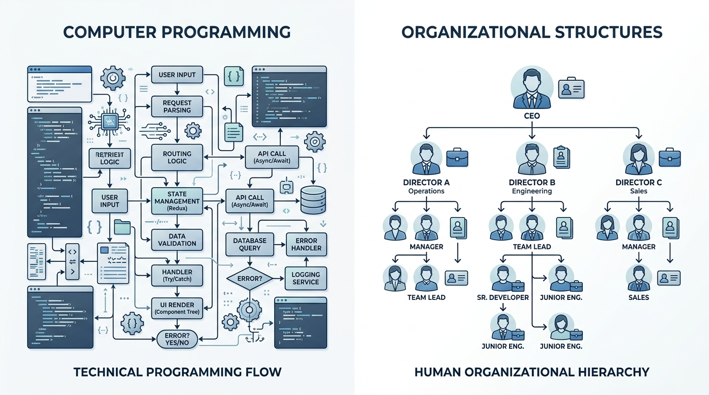
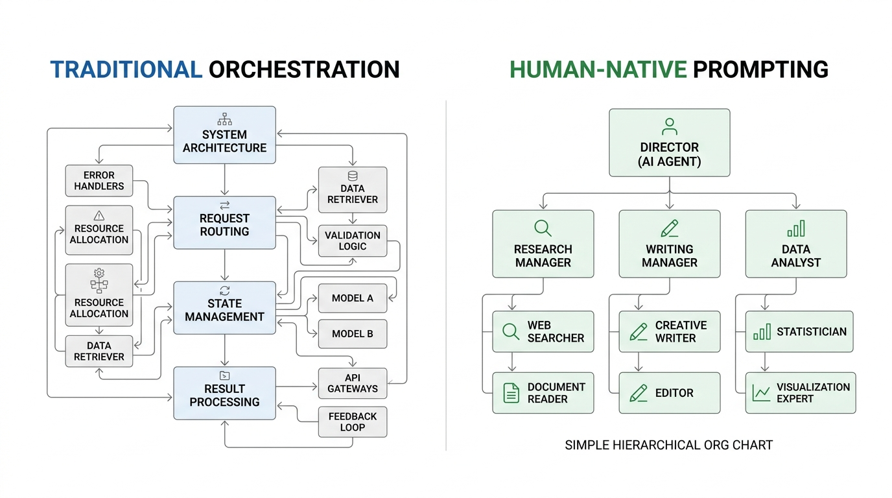

# The Analogy Advantage: Unlocking LLM Intelligence Without Extra Tokens

LLMs are trained on the full corpus of human experience—not just organizational knowledge, but educational frameworks, creative processes, scientific methodologies, and countless domain-specific patterns. Yet most teams build complex technical scaffolding when the right analogy could unlock sophisticated intelligence using almost no tokens.

## Finding the Right Semantic Shortcut

LLMs have internalized vast semantic patterns from every domain of human experience. The key is finding the right analogy to unlock the intelligence you need.

**Organizational patterns**: "You're a trusted senior mentor leading a high-performing team. When someone brings you a challenge, guide them to the right resources and help them build collaborative relationships."

**Educational frameworks**: "You're an expert tutor focused on continuous improvement. When you encounter gaps in understanding, create scaffolded learning experiences. Celebrate small wins, adjust your approach based on feedback, and help build confidence through progressive mastery."

**Creative processes**: "You're a seasoned director collaborating with talented artists. Your role is to recognize each person's strengths, provide clear creative direction when needed, and create an environment where breakthrough ideas can emerge naturally."

Each analogy activates different semantic networks already embedded in the model's training. You're not programming new behavior—you're accessing sophisticated domain intelligence that cost zero additional tokens to include.

## Why Analogies Unlock So Much Intelligence

LLMs trained on everything: scientific papers, educational curricula, management literature, artistic critiques, therapeutic approaches, and millions of domain-specific conversations. They've internalized the implicit patterns of how experts think, learn, create, and solve problems across virtually every field.

Traditional AI required explicit programming of each capability. Modern LLMs already contain sophisticated mental models from education, psychology, creative arts, scientific research, and countless other domains. The breakthrough is recognizing that the right analogy can instantly activate any of these semantic networks without additional tokens.

## The Performance Advantage

The highest-performing LLM implementations find analogies that activate relevant semantic patterns the model already understands. Instead of building technical scaffolding, express your requirements using domain frameworks that feel natural.

**Technical orchestration**: Define agent roles, implement communication protocols, specify task routing logic, handle failure modes, manage state transitions, coordinate resource allocation.

**Analogy-driven approaches**:
- **For coordination**: "You're leading a successful consulting practice matching client challenges with specialists from your network."
- **For learning**: "You're a master teacher helping students progress through increasingly complex concepts at their own pace."
- **For creativity**: "You're a director fostering breakthrough ideas by creating the right collaborative environment for your team."

Each analogy activates decades of domain-specific wisdom already encoded in the model—management psychology, educational research, creative processes—often achieving sophisticated results with remarkably few tokens.

## The Analogy-First Future

This insight transforms how we approach AI system design. Instead of complex technical architectures, the most powerful implementations will be those that identify and activate the right semantic patterns through carefully chosen analogies.

LLMs contain the collective wisdom of human civilization—not just organizational knowledge, but educational methodologies, creative processes, scientific thinking, therapeutic approaches, and domain expertise from every field. The challenge isn't building new intelligence; it's learning to access what's already there.

The future belongs to teams who master this analogy advantage: finding the precise semantic shortcut that unlocks exactly the intelligence they need, using almost no extra tokens. Every domain pattern is waiting—the question is whether you can find the right key.